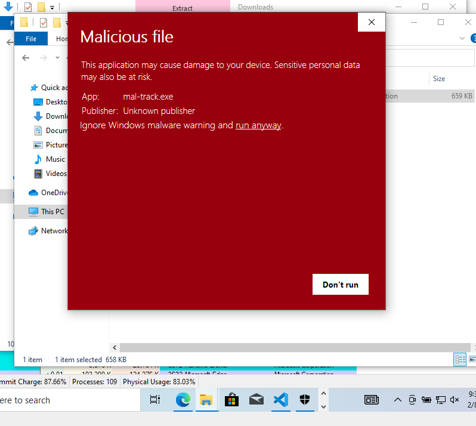
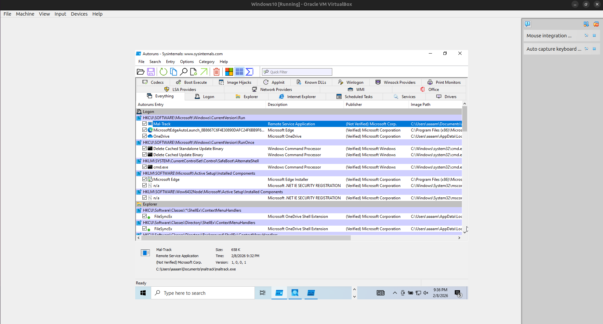
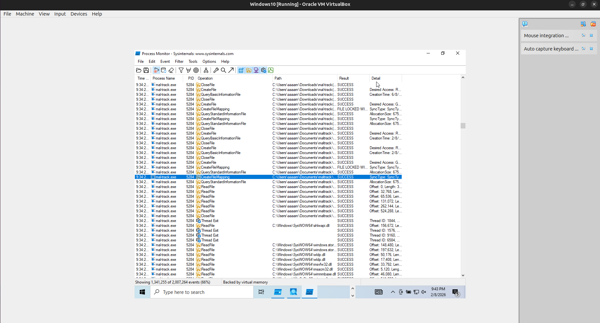
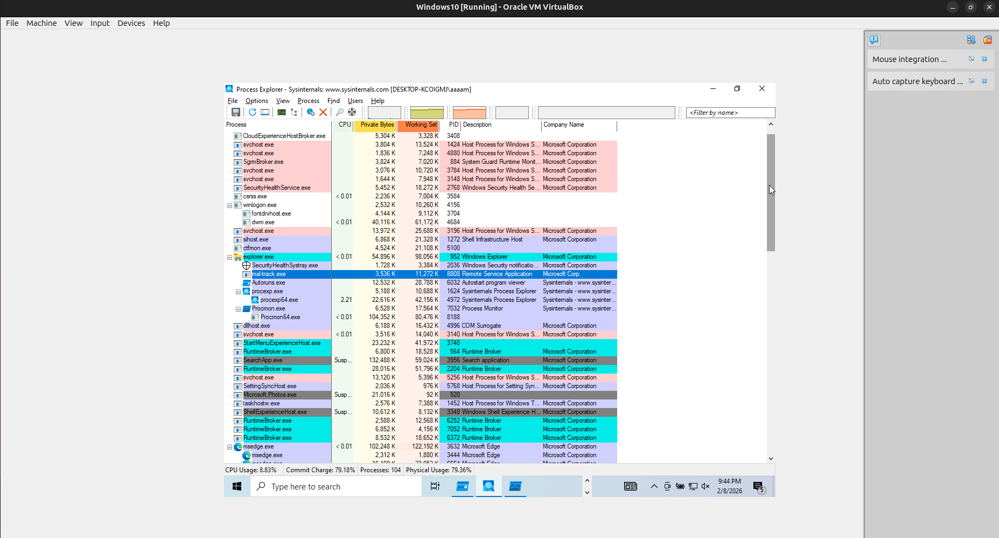
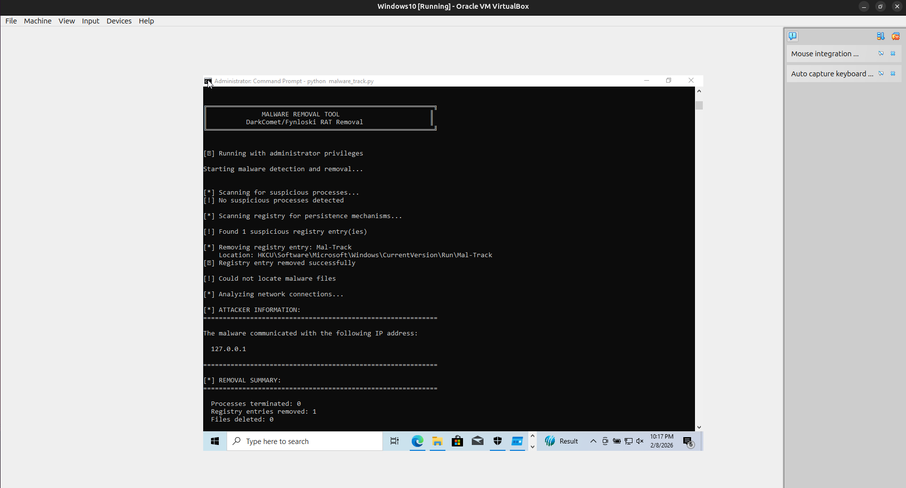
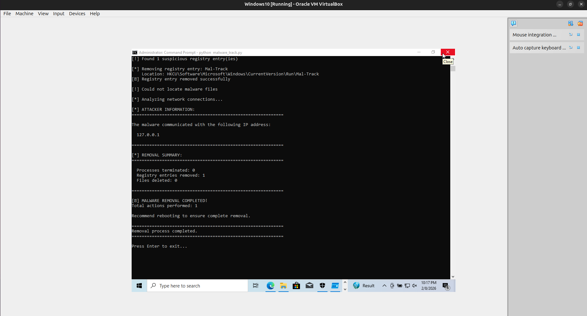
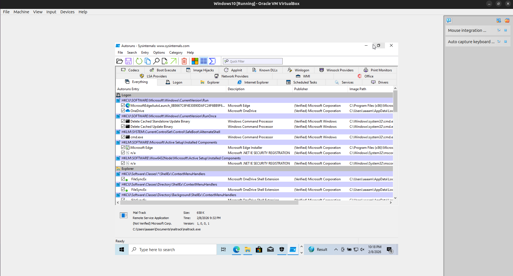
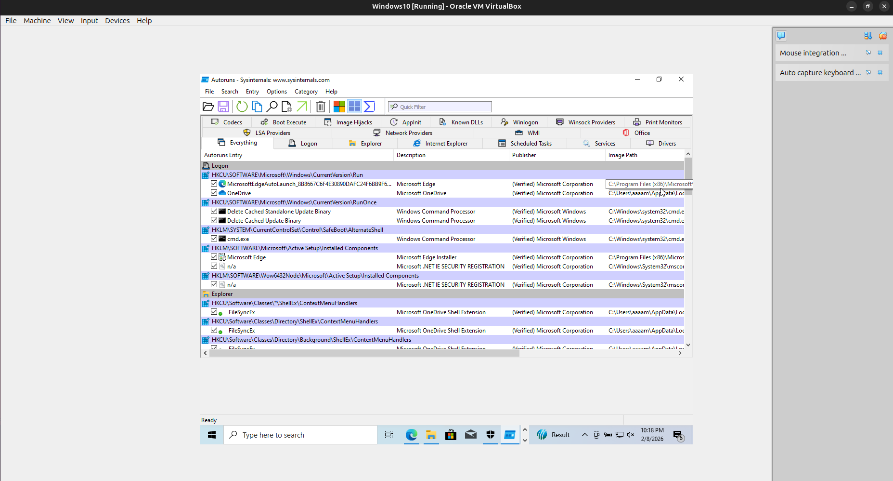
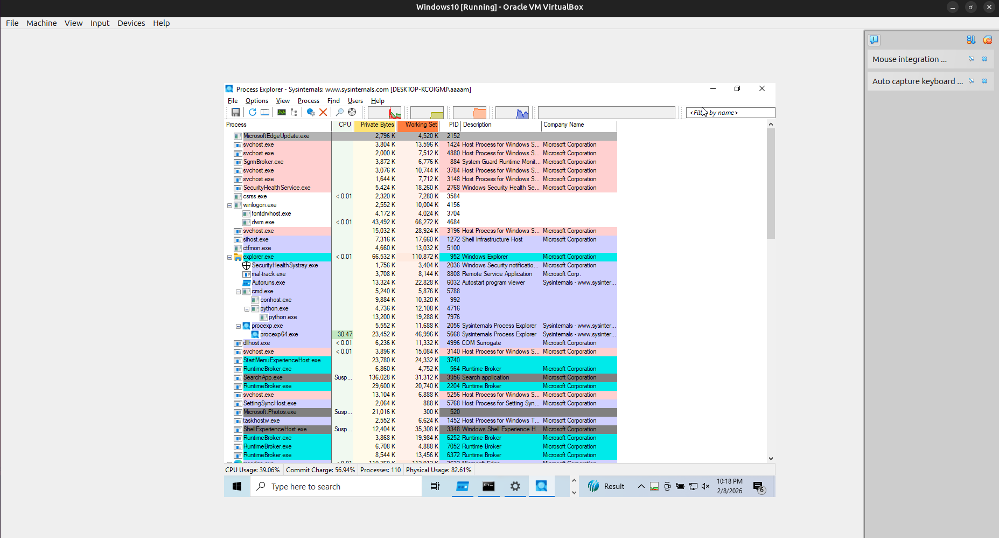

# Defuse - Malware Analysis and Eradication (DarkComet/Fynloski RAT)

## Overview
This project demonstrates end-to-end malware analysis and mitigation for a Windows-based RAT sample in a controlled virtual machine. The included program automates detection, removal of persistence, and cleanup while extracting the attacker IP address used by the malware.

## Project Objectives
- Understand malware behavior and persistence mechanisms.
- Identify and neutralize active malware processes.
- Remove registry startup entries and associated files.
- Extract attacker IP address from active connections.
- Document ethical and legal responsibilities in malware analysis.

## Program Explanation
The removal tool is implemented in `malware_track.py` and targets suspicious process, registry, and file artifacts typically associated with DarkComet/Fynloski-style RATs.

Key functions:
- Process detection and termination with `tasklist` and `taskkill`.
- Persistence removal by scanning Windows Run keys (HKCU/HKLM).
- File discovery with `wmic` to locate executables before termination.
- File cleanup and optional empty directory removal.
- Attacker IP extraction using `netstat -ano` and filtering non-local IPs.

Safety note: the program is intended to run only inside an isolated Windows VM with administrator privileges.

## Walkthrough (Analysis and Eradication)
1. Created a Windows VM snapshot to enable safe rollback.
2. Executed the malware sample in a controlled environment and observed behavior.
3. Monitored processes (`tasklist`) and connections (`netstat`) to identify the malicious executable and its network activity.
4. Inspected registry Run keys to confirm persistence mechanisms.
5. Ran `malware_track.py` as Administrator to terminate the malware, remove persistence, and delete artifacts.
6. Verified that the process was terminated and registry entries were removed.

## Remediation Recommendations
- Use application allow-listing to prevent unknown executables from running.
- Keep Windows and security tools patched.
- Disable or restrict autorun behaviors and monitor Run keys.
- Implement network egress filtering and alerting for suspicious outbound connections.
- Train users on phishing awareness and suspicious attachments.

## Malware Mitigation Report Email
```
To: security@[organization].com
Subject: Malware Analysis Report: Mitigation of Mal-Track

Dear Security Team,

I am writing to report the successful analysis and mitigation of Mal-Track identified during an educational malware analysis exercise. Below are the details:

Summary:
The malware executed as maltrack.exe and established persistence via the Run key entry Mal-Track (HKCU\\Software\\Microsoft\\Windows\\CurrentVersion\\Run). It was observed as “Remote Service Application” and attempted network activity.

Proof of Mitigation:
The malicious Run key entry (Mal-Track) was removed and the system was scanned to ensure no remaining suspicious persistence. The remediation tool reported successful cleanup actions.

Attacker Information:
The malware communicated with the following IP address: 127.0.0.1

Please feel free to reach out for further clarification or additional details.

Best regards,
[Your Name]
[Your Contact Information]
```

## Ethical Hacking Report
- Controlled environment: Malware analysis must be performed in isolated VMs with snapshots to prevent accidental spread or damage.
- Legal and ethical boundaries: Use malware samples only for authorized, educational research. Never deploy or test on real systems without explicit permission.
- Risk of uncontrolled execution: Running malware outside a sandbox can lead to data theft, lateral movement, and legal liability.

## Usage
Run inside a Windows VM with Administrator privileges:
```
python malware_track.py
```
Optional flags:
- `--no-color`
- `--manual`
- `--process <name>`
- `--file <path>`

## Screenshots (Process Evidence)
1. Malicious file warning for `mal-track.exe` shown by Windows Defender SmartScreen.



2. Persistence evidence: Autoruns shows `Mal-Track` in `HKCU\\Software\\Microsoft\\Windows\\CurrentVersion\\Run` with the executable path.



3. File activity evidence: Process Monitor shows `maltrack.exe` accessing files and DLLs during execution.



4. Process evidence: Process Explorer highlights `maltrack.exe` running as “Remote Service Application.”



5. Tool output: removal run displays attacker IP extraction (`127.0.0.1`) and remediation steps.



6. Tool output: completion summary with actions performed.



7. Post-cleanup check: Autoruns view after removal (run key entry no longer present).



8. Post-cleanup check: additional Autoruns view confirming no persistence entries.



9. Post-cleanup check: Process Explorer shows no active `maltrack.exe` process.



## Disclaimer
This project is for educational purposes only. Do not execute or distribute malware outside controlled, authorized environments.
